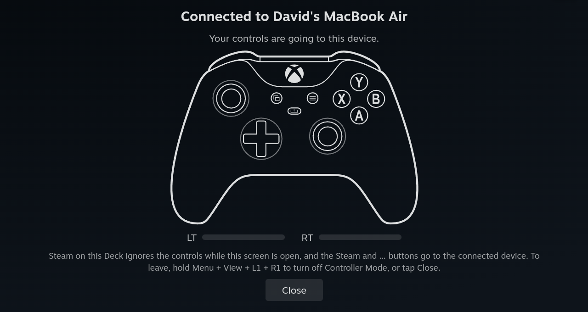
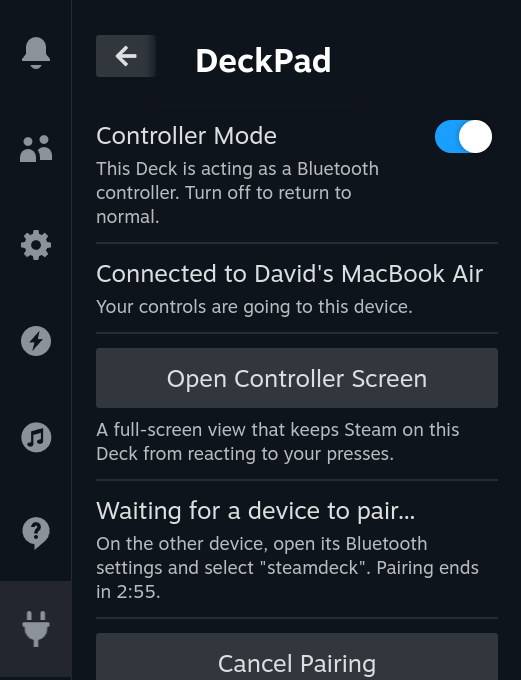
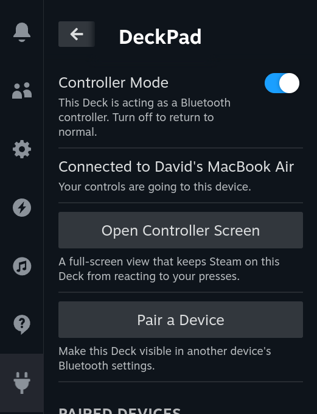
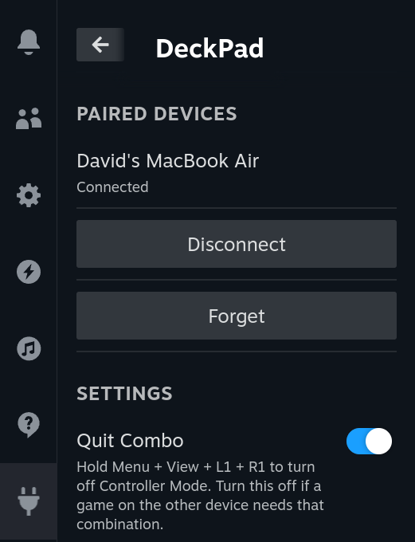
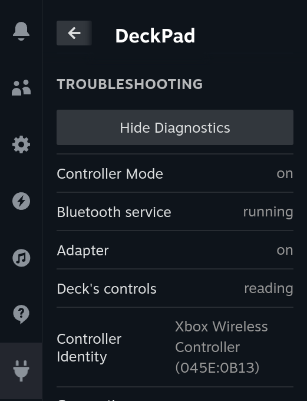

# DeckPad

DeckPad is a [Decky Loader](https://github.com/SteamDeckHomebrew/decky-loader) plugin that lets you use
your Steam Deck as a Bluetooth game controller for another device, such as a PC, a phone, or a tablet.
The other device pairs with the Deck through its own Bluetooth settings, like any wireless controller,
and needs no extra software.

The [Bluetooth](https://github.com/Outpox/Bluetooth) plugin connects devices *to* the Deck; DeckPad works
the other way round. The two can be installed together.



## Words used here

- **Host**: the device the Deck acts as a controller for.
- **Controller Mode**: while it is on, the Deck sends its controls to a connected Host.
- **Pairing Mode**: a three-minute window inside Controller Mode in which a new Host can pair.

## Requirements

- A Steam Deck with [Decky Loader](https://github.com/SteamDeckHomebrew/decky-loader).
- A Host that supports Bluetooth Low Energy game controllers (HID over GATT). Classic-only Bluetooth
  Hosts cannot connect.

## Installation

Install **DeckPad** from the Decky Plugin Store: open the Quick Access menu (`…`), select the Decky tab,
open the store, and install **DeckPad**. Everything it needs ships inside the plugin: no system
packages, no changes to SteamOS's read-only files, no Desktop Mode setup.

### Manual installation

1. Download [`DeckPad.zip`](https://github.com/thedavidweng/DeckPad/releases/latest/download/DeckPad.zip)
   from the [latest release](https://github.com/thedavidweng/DeckPad/releases/latest) and copy it to the
   Deck.
2. In Decky's settings, turn on **Developer mode** (General tab).
3. On the **Developer** tab, next to **Install Plugin from ZIP File**, select **Browse** and pick the zip.

## Pairing a Host

1. Open the Quick Access menu (`…`), select the Decky tab, and open **DeckPad**.
2. Turn on **Controller Mode**, then select **Pair a Device**.
3. On the Host, scan for Bluetooth devices and select the Deck (by default `steamdeck`, with a game
   controller icon). Accept if the Host asks you to confirm.
4. The panel shows "Paired with *Host*".

Outside Pairing Mode the Deck does not show up in other devices' scan lists.

<p>
  
  
</p>

## Everyday use

- **Reconnecting.** With Controller Mode on, a Paired Host can reconnect without pairing again, either by
  itself or when you select the Deck in its Bluetooth settings.
- **Disconnect** drops the link and stops that Host from reconnecting by itself until you select
  **Allow Reconnecting**.
- **Forget** removes the pairing on the Deck. Also remove the Deck on the Host, or its next pairing
  attempt fails.
- **Controller Screen.** While a Host is connected, select **Open Controller Screen**. It keeps Steam on
  the Deck from reacting to your presses and shows what the Host receives. Leave with the Quit Combo or
  by tapping **Close**.
- **Quit Combo.** Hold Menu + View + L1 + R1 to turn Controller Mode off from the Deck's controls. If a
  game on the Host needs that combination, turn **Quit Combo** off in the panel's Settings.
- **Turning Controller Mode off** disconnects the Host and returns Bluetooth on the Deck to normal. It is
  always off after a reboot or plugin reload.



### Controls

DeckPad presents itself to the Host as an Xbox Wireless Controller.

| Deck | Host sees |
|---|---|
| A, B, X, Y | A, B, X, Y |
| L1, R1 | Left and right bumpers |
| L2, R2 | Left and right triggers (analog) |
| Left and right sticks, L3, R3 | Left and right sticks and stick clicks |
| D-pad | D-pad |
| View, Menu | View, Menu |
| Steam button | Xbox (Guide) button |
| `…` (Quick Access) button | Share button |
| L4, L5, R4, R5, trackpads, gyro | Not sent |

## Known limitations

- One Host at a time.
- Rear buttons, trackpads, gyro, and rumble are not supported.
- A game running on the Deck still receives the controls; don't run one while using the Deck as a
  controller.

More in [docs/limitations.md](docs/limitations.md).

## What DeckPad changes on your Deck

DeckPad runs as root. While Controller Mode is on, it changes bluetoothd's DeviceID in memory so Hosts
see an Xbox controller, shortens the adapter's Bluetooth LE connection interval, and answers pairing
requests from Hosts. All of it is undone when Controller Mode turns off. Uninstalling removes only the
pairings made through DeckPad and DeckPad's own files. Details: [docs/system-changes.md](docs/system-changes.md).

## Troubleshooting

Expand **Troubleshooting** in the panel for a diagnostics report, and attach it when you
[report an issue](https://github.com/thedavidweng/DeckPad/issues). Common problems and every error
message: [docs/troubleshooting.md](docs/troubleshooting.md).




## Development

- Backend tests need `dbus-daemon` and Python 3.11 or newer: `mise x python@3.11 -- pnpm test`.
- Frontend build: `pnpm i && pnpm build`. The store CI uses Node 20, pnpm 9, `pnpm i --frozen-lockfile`,
  and the [Decky CLI](https://github.com/SteamDeckHomebrew/cli).
- Plugin zip, the same layout the store ships (needs `zip`):

  ```sh
  pnpm i --frozen-lockfile && pnpm build
  mkdir -p out/DeckPad
  cp -r dist py_modules main.py package.json plugin.json LICENSE README.md out/DeckPad/
  (cd out && zip -r DeckPad.zip DeckPad -x '*/__pycache__/*')
  ```
- Website: `site/`, deployed to GitHub Pages by `.github/workflows/pages.yml`, which copies
  `docs/screenshots/` in next to it. Preview it by doing the same into `_site/` and serving that folder.
- Design decisions: `docs/adr/`. Vocabulary: `GLOSSARY.md`. Verification status and open unknowns:
  `docs/verification.md`. Vendored Python modules: `py_modules/README.md`.

## Acknowledgements

- [DeckJoy](https://github.com/Lucaber/deckjoy) by Lucaber showed that a Steam Deck can act as a
  controller for another device. DeckPad does not use its code.
- [DeckControllerOS](https://github.com/Zak-Bahm/DeckControllerOS) by Zak Bahm documented the Deck's
  controller reports and BlueZ peripheral pitfalls. DeckPad does not include its code.
- [ESP32-BLE-CompositeHID](https://github.com/Mystfit/ESP32-BLE-CompositeHID) (MIT, Copyright (c) 2021
  lemmingDev) provides the Xbox Wireless Controller HID report descriptor.
- [dbus-fast](https://github.com/Bluetooth-Devices/dbus-fast) (MIT) and CPython's `xml.etree` (PSF
  License) are bundled unmodified.
- The Linux kernel's `hid-steam` driver and SDL's Xbox controller support were used as references for
  report layouts.
- [decky-plugin-template](https://github.com/SteamDeckHomebrew/decky-plugin-template) (BSD 3-Clause) is
  the starting point of this plugin.

DeckPad is not affiliated with Valve or Microsoft. Xbox is a trademark of Microsoft.

## License

BSD 3-Clause; see `LICENSE`, which also contains the decky-plugin-template license. Bundled third-party
software is listed in `THIRD_PARTY_NOTICES.md`.
